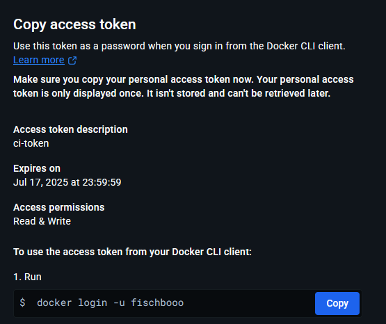
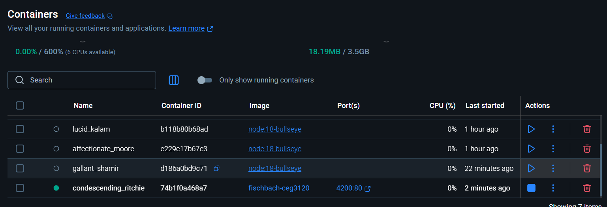
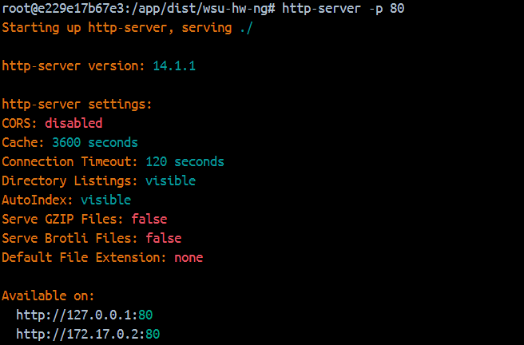

# Part 1 - Docker-ize it

### How to install Docker for your OS
1. installing `docker`: 
- `sudo apt update`

- `sudo apt install -y apt-transport-https ca-certificates curl software-properties-common`

- `curl -fsSL https://download.docker.com/linux/ubuntu/gpg | sudo apt-key add -`

- `sudo add-apt-repository "deb [arch=amd64] https://download.docker.com/linux/ubuntu $(lsb_release -cs) stable"`

- `sudo apt update`

- `sudo apt install docker-ce`

- `sudo systemctl start docker`

- `sudo systemctl enable docker`

- `sudo usermod -aG docker $USER (allows docker commands to be run without root)`

2. Setting up a Container
    1. Container to test
    - `docker run -d -p 4200:80 blake_image`
    - `-d`: detached mode which runs container in background
    - `-p 4200:80`: maps port 4200 on the host to port 80 inside the container
    - `blake_image`: name of the image built from the Dockerfile
    
    2. Container to get additional dependencies
    ```
    RUN apt-get update && \
        apt-get install -y curl && \
        curl -fsSL https://deb.nodesource.com/setup_18.x | bash - && \
        apt-get install -y nodejs && \
        npm install -g @angular/cli
    COPY . /app
    WORKDIR /app
    RUN npm install
    ```


    - `RUN apt-get update` : refreshes the package list
    - `apt-get install -y curl`
    - `curl -fsSL https://deb.nodesource.com/setup_18.x | bash -` : adds Node.js 18 repository
    - `apt-get install -y nodejs` : installs Node.js runtime and npm
    - `npm install -g @angular/cli` : installs Angular CLI globally
    - `COPY . /app` : copies project files to /app directory in container
    - `WORKDIR /app` : sets working directory
    - `npm install` : installs project-specific dependencies from package.json
    3. Container to run the application
    ```
    RUN ng build --configuration production
    CMD ["npx", "http-server", "dist/<your-app-name>", "-p", "80"]
    ```

    - `ng build --configuration production` : builds the Angular app for production
    - `CMD ["npx", "http-server", "dist/<your-app-name>", "-p", "80"]` : starts a web server on port 80
    - `npx http-server` : runs a simple static server from the built dist/ folder
    - `"dist/<your-app-name>"` : points to the build output folder
    - `"-p", "80"` : tells the server to run on port 80 inside the container

3. Dockerfile & Building Images
    1. build an image from Dockerfile
    ```
    docker build -t angular_image .
    ```
    - `docker build` : command to build an image
    - `-t angular_image` : tags the image with the name angular_image
    - `.` : tells Docker to use the current directory (where the Dockerfile is located)
    2. Run a container
    ```
    docker run -d -p 4200:80 blake_image
    ```
    - `-d` : detached mode, runs container in the background
    - `-p 4200:80` : maps port 4200 on the host to port 80 inside the container
    - `blake_image` : name of the image that was just built

4. Working with your DockerHub Repository
    1. Create a public repo in DockerHub
    - Go to https://hub.docker.com
    - Sign in with your DockerHub account
    - Click your profile icon → Repositories → Create Repository
    - Fill in:
        - Repository Name: e.g., angular-app
        - Visibility: set to Public
    - Click Create
    2. Create a PAT for authentication
    - Go to https://hub.docker.com/settings/security
    - Scroll to Access Tokens, click New Access Token
    - Enter a name for the token 
    - Set Read/Write scope — recommended for pushing images
    - Click Generate and copy the token
    3. Authenticate with DockerHub
    - `docker login`
    - Enter your DockerHub username
    - password: Personal Access Token
    4. Pushing container image
    - 
    ```
    docker tag angular_image your-dockerhub-username/angular-app
    docker push your-dockerhub-username/angular-app
    ```

# Part 2 - GitHub Actions and DockerHub
1. Creating a DockerHub Personal Access Token (PAT)
    - Go to DockerHub Account Settings → Security.
    - Click "New Access Token".
    - Name it.
    - Set the Access Scope to: Read/Write 
    - Save the token immediately — you won't be able to view it again.


2. Setting Repository Secrets in GitHub
    - Go to your GitHub repository.
    - Click Settings → Secrets and variables → Actions.
    - Click New repository secret.
    - Add the following:
        - DOCKER_USERNAME: your DockerHub username
        - DOCKER_TOKEN: the access token you just created


## Pictures 
- 
- 
- 
- 
- 
- 
- 
- 
- 
- 